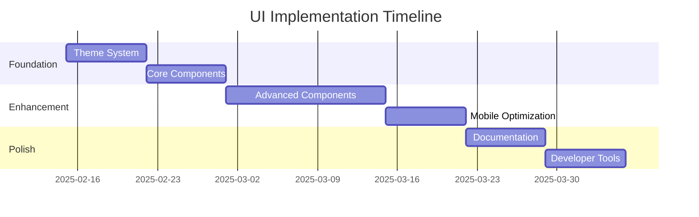

# UI System Documentation

## Overview

This directory contains comprehensive documentation for our UI system improvements, focusing on the integration of shadcn/ui, Tailwind CSS, and modern web development practices.

## Documents

### 1. [UI Roadmap](UI_ROADMAP.md)
High-level overview of the implementation timeline and success metrics.
- Implementation phases
- Technical requirements
- Quality assurance
- Maintenance plan

### 2. [Styling Improvements](STYLING_IMPROVEMENTS.md)
Detailed analysis of styling system improvements.
- Theme configuration
- Component library updates
- Layout improvements
- Animation system

### 3. [Implementation Plan](IMPLEMENTATION_PLAN.md)
Step-by-step guide for implementing improvements.
- Phase breakdown
- Component migration
- Testing strategy
- Success criteria

### 4. [Component Analysis](COMPONENT_ANALYSIS.md)
Detailed analysis of current components and recommendations.
- Current issues
- Accessibility considerations
- Mobile responsiveness
- Performance optimization

## Quick Start

1. **Theme System**
   ```bash
   # Install dependencies
   npm install @shadcn/ui
   
   # Generate theme
   npx shadcn-ui@latest init
   ```

2. **Component Development**
   ```bash
   # Add new component
   npx shadcn-ui@latest add [component-name]
   ```

3. **Testing**
   ```bash
   # Run tests
   npm run test
   
   # Check accessibility
   npm run test:a11y
   ```

## Key Features

- 🎨 Complete theme system
- 📱 Mobile-first design
- ♿️ WCAG 2.1 AA compliance
- 🚀 Optimized performance
- 📖 Comprehensive documentation

## Implementation Timeline



## Directory Structure

```
ui/
├── README.md           # This file
├── UI_ROADMAP.md      # Implementation roadmap
├── STYLING_IMPROVEMENTS.md
├── IMPLEMENTATION_PLAN.md
└── COMPONENT_ANALYSIS.md
```

## Getting Started

1. Review the [UI Roadmap](UI_ROADMAP.md) for a high-level overview
2. Check [Styling Improvements](STYLING_IMPROVEMENTS.md) for detailed changes
3. Follow the [Implementation Plan](IMPLEMENTATION_PLAN.md) for step-by-step guide
4. Reference [Component Analysis](COMPONENT_ANALYSIS.md) for specific component details

## Contributing

When contributing to the UI system:

1. Follow the established patterns
2. Maintain accessibility standards
3. Include proper documentation
4. Add necessary tests
5. Consider performance implications

## Resources

- [shadcn/ui Documentation](https://ui.shadcn.com)
- [Tailwind CSS](https://tailwindcss.com)
- [WCAG Guidelines](https://www.w3.org/WAI/WCAG21/quickref/)
- [Next.js Documentation](https://nextjs.org/docs)

## Support

For questions or issues:
1. Check existing documentation
2. Review component examples
3. Consult the development team
4. Create detailed issue reports

## Next Steps

1. Review documentation
2. Set up development environment
3. Begin theme implementation
4. Follow implementation plan
5. Monitor progress against roadmap

## Success Metrics

- ✅ Lighthouse score > 90
- ✅ WCAG 2.1 AA compliance
- ✅ < 200KB initial bundle
- ✅ 100% TypeScript coverage
- ✅ Complete documentation