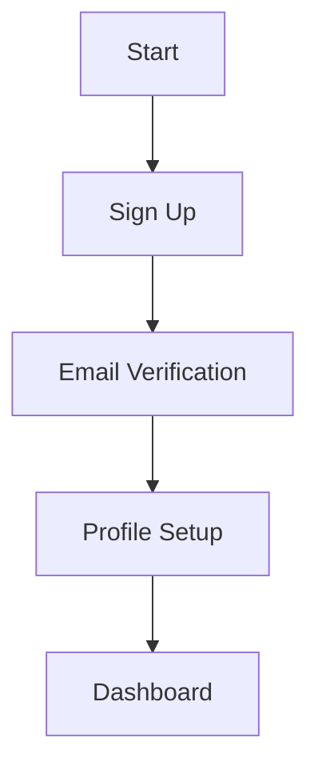

# TUP Assistant UI Action Plan

## Overview
This document outlines the prioritized actions needed to address the gaps identified in:
- NAVIGATION_GAPS.md - Navigation structure and missing pages
- AUTH_DEMO_IMPROVEMENTS.md - Authentication and demo system
- USER_FLOW.md - User journey and features

## Phase 1: Critical Path (Week 1)

### 1. Authentication Foundation
- Complete sign-up flow
- Implement proper login
- Add password reset
- Set up session management



### 2. Demo System Enhancement
- Implement guided tour
- Add demo data initialization
- Create feature showcase
- Set up progress tracking

### 3. Essential Pages
- Create /about
- Implement /pricing
- Add /docs structure
- Set up /support

## Phase 2: Core Features (Week 2)

### 1. User Management
- Profile management
- Settings configuration
- Notification system
- Preference storage

### 2. Navigation Improvements
- Fix footer links
- Add breadcrumbs
- Enhance mobile navigation
- Implement search

### 3. Content Management
- Documentation system
- Help center
- Legal pages
- Resource library

## Phase 3: Enhancement (Week 3)

### 1. User Experience
- Add loading states
- Improve error handling
- Enhance feedback
- Add animations

### 2. Feature Integration
- Social authentication
- Data export
- Advanced search
- Batch operations

### 3. Performance
- Optimize loading
- Implement caching
- Add prefetching
- Optimize images

## Implementation Details

### 1. Authentication System
```typescript
// auth/AuthProvider.tsx
interface AuthState {
  user: User | null;
  loading: boolean;
  error: Error | null;
}

const AuthProvider: React.FC = ({ children }) => {
  const [state, dispatch] = useReducer(authReducer, initialState);
  
  return (
    <AuthContext.Provider value={{ state, dispatch }}>
      {children}
    </AuthContext.Provider>
  );
};
```

### 2. Demo System
```typescript
// demo/DemoProvider.tsx
interface DemoState {
  step: number;
  progress: number;
  completed: string[];
}

const DemoProvider: React.FC = ({ children }) => {
  const [state, dispatch] = useReducer(demoReducer, initialState);
  
  return (
    <DemoContext.Provider value={{ state, dispatch }}>
      {children}
    </DemoContext.Provider>
  );
};
```

### 3. Navigation System
```typescript
// navigation/NavigationProvider.tsx
interface NavigationState {
  currentPath: string;
  breadcrumbs: Breadcrumb[];
  history: string[];
}

const NavigationProvider: React.FC = ({ children }) => {
  const [state, dispatch] = useReducer(navigationReducer, initialState);
  
  return (
    <NavigationContext.Provider value={{ state, dispatch }}>
      {children}
    </NavigationContext.Provider>
  );
};
```

## Success Criteria

### 1. Authentication
- [ ] Complete sign-up flow
- [ ] Working login system
- [ ] Password reset functional
- [ ] Session management working
- [ ] Profile system complete

### 2. Demo System
- [ ] Guided tour implemented
- [ ] Demo data loading
- [ ] Feature showcase working
- [ ] Progress tracking functional
- [ ] Reset capability working

### 3. Navigation
- [ ] All links functional
- [ ] Breadcrumbs working
- [ ] Mobile nav complete
- [ ] Search implemented
- [ ] Footer links working

## Testing Strategy

### 1. Unit Tests
```typescript
// auth/__tests__/auth.test.ts
describe('Authentication', () => {
  test('sign up flow', async () => {
    // Test implementation
  });
  
  test('login process', async () => {
    // Test implementation
  });
  
  test('password reset', async () => {
    // Test implementation
  });
});
```

### 2. Integration Tests
```typescript
// demo/__tests__/demo.test.ts
describe('Demo System', () => {
  test('guided tour', async () => {
    // Test implementation
  });
  
  test('data loading', async () => {
    // Test implementation
  });
  
  test('progress tracking', async () => {
    // Test implementation
  });
});
```

### 3. E2E Tests
```typescript
// e2e/user-journey.test.ts
describe('User Journey', () => {
  test('complete signup flow', async () => {
    // Test implementation
  });
  
  test('demo to signup conversion', async () => {
    // Test implementation
  });
  
  test('feature exploration', async () => {
    // Test implementation
  });
});
```

## Monitoring

### 1. Performance Metrics
- Page load times
- Time to interactive
- First contentful paint
- Largest contentful paint

### 2. User Metrics
- Sign-up completion rate
- Demo completion rate
- Feature usage
- Session duration

### 3. Error Tracking
- Authentication failures
- Navigation errors
- API failures
- UI errors

## Documentation

### 1. Technical Docs
- Architecture overview
- Component documentation
- API documentation
- Testing guide

### 2. User Docs
- User guides
- Feature documentation
- FAQs
- Troubleshooting

### 3. Development Docs
- Setup guide
- Contributing guide
- Code style guide
- Release process

## Timeline

Week 1:
- Authentication system
- Demo foundation
- Essential pages

Week 2:
- User management
- Navigation system
- Content structure

Week 3:
- UX improvements
- Feature integration
- Performance optimization

## Next Steps

1. Begin Phase 1 implementation
   - Set up authentication
   - Create demo system
   - Add essential pages

2. Review and approve designs
   - Authentication flows
   - Demo experience
   - Navigation structure

3. Start development
   - Set up project structure
   - Implement core features
   - Begin testing