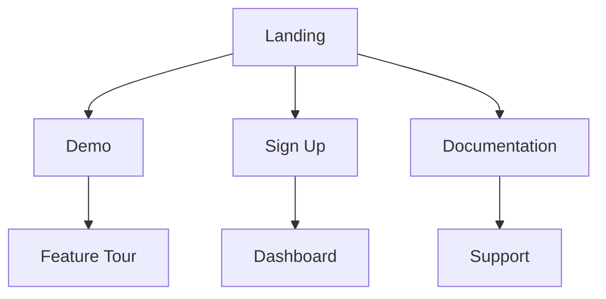
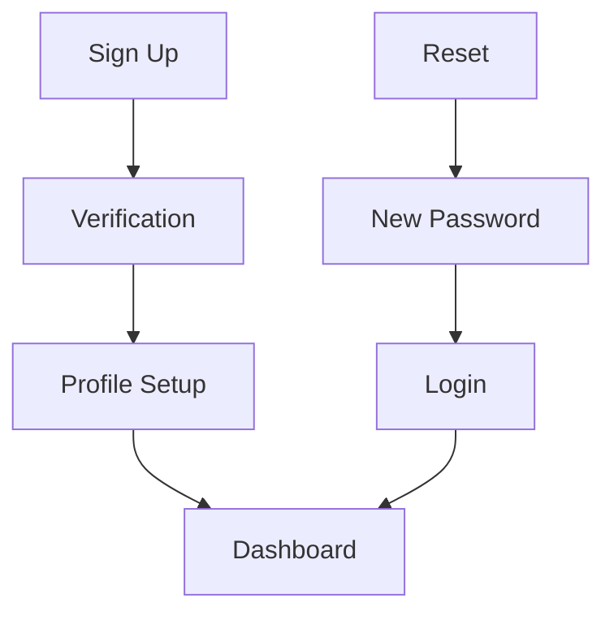

# TUP Assistant UI Improvements

## Overview

This directory contains comprehensive documentation for improving the TUP Assistant UI system. The documentation is split into several focused documents that cover different aspects of the improvements needed.

## Documents

### 1. [Navigation Gaps](NAVIGATION_GAPS.md)
Identifies missing pages and navigation issues:
- Missing essential pages
- Broken navigation flows
- Footer link issues
- Navigation structure problems

### 2. [Authentication & Demo Improvements](AUTH_DEMO_IMPROVEMENTS.md)
Details enhancements needed for authentication and demo systems:
- Complete authentication flow
- Enhanced demo experience
- User onboarding
- Feature showcase

### 3. [Action Plan](ACTION_PLAN.md)
Provides a prioritized implementation plan:
- Phase 1: Critical path
- Phase 2: Core features
- Phase 3: Enhancement
- Testing strategy

### 4. [Architectural Improvements](ARCHITECTURAL_IMPROVEMENTS.md)
Outlines architectural changes needed:
- Navigation system
- Component organization
- Style system
- Testing strategy

## Implementation Priority

1. **Week 1: Foundation**
   - Authentication system
   - Essential pages
   - Navigation structure
   - Basic demo system

2. **Week 2: Enhancement**
   - User management
   - Content system
   - Advanced demo features
   - Documentation

3. **Week 3: Polish**
   - Performance optimization
   - UI refinement
   - Testing
   - Final documentation

## Key Improvements

### Navigation


### Authentication


### Component Architecture
```
components/
├── features/    # Feature-specific
├── layout/      # Layout components
├── ui/          # Base UI components
└── shared/      # Shared utilities
```

## Success Metrics

### 1. Technical
- [ ] All TypeScript errors resolved
- [ ] 100% test coverage
- [ ] Performance targets met
- [ ] Accessibility compliance

### 2. User Experience
- [ ] Complete user flows
- [ ] Intuitive navigation
- [ ] Responsive design
- [ ] Error handling

### 3. Development
- [ ] Clean architecture
- [ ] Maintainable code
- [ ] Clear documentation
- [ ] Efficient build process

## Getting Started

1. Review all documentation
2. Set up development environment
3. Follow implementation plan
4. Run tests and verify

## Development Workflow

1. **Planning**
   - Review documentation
   - Create task breakdown
   - Set up tracking

2. **Implementation**
   - Follow priority order
   - Maintain documentation
   - Run tests
   - Review code

3. **Review**
   - Code review
   - Testing review
   - Documentation review
   - Performance review

## Resources

### Documentation
- [Next.js Documentation](https://nextjs.org/docs)
- [shadcn/ui Documentation](https://ui.shadcn.com)
- [Tailwind CSS Documentation](https://tailwindcss.com/docs)

### Tools
- TypeScript
- Next.js
- shadcn/ui
- Tailwind CSS

## Contributing

1. Review existing documentation
2. Follow coding standards
3. Add tests
4. Update documentation
5. Submit pull request

## Support

For questions or issues:
1. Check documentation
2. Review existing issues
3. Create detailed report
4. Contact development team

## Next Steps

1. Review all documentation
2. Begin implementation
3. Track progress
4. Regular reviews
5. Update documentation